# 🔥SlideMaster: Streamlined Presentation Deployment

 SlideMaster is a solution for deploying [Slidev](https://sli.dev/) presentations from GitHub, enabling seamless access through a web browser. This application eliminates common presentation challenges by providing a centralized, platform for slide management and distribution.

## 🚀 Overview

SlideMaster addresses common challenges in presentation delivery by:

1. 📦 Retrieving Slidev presentations from a GitHub repository
2. 💻 Rendering them on a server using Streamlit
3. 🌐 Making them accessible via standard web browsers

This approach eliminates screen sharing complications and ensures consistent presentation experiences across different environments.

## 🐳 Docker Deployment

For simplified deployment with containerization:

```bash
# Clone the repository
git clone https://github.com/yourusername/slides_deployment.git
cd slides_deployment

# Configure authentication
echo "your_github_token" > ./secrets/github_token
echo "your_password" > ./secrets/streamlit_passwords
# hash password (to make it somehow secure)
python hash_password.py -f ./secrets/streamlit_passwords

nano .env # set the env vars accordingly 
# Deploy with Docker Compose
docker-compose up --build -d
```

Access the application at http://localhost:8502 after deployment.

## ⚙️ Application Workflow



The application process:
1. 🔒 Authenticates users via password protection (unsecure)
2. 📇 Retrieves available presentations from GitHub
3. ⬇️ Downloads selected presentation content
4. 🖥️ Initializes a Slidev server for rendering
5. 🖼️ Presents content in a full-screen interface

## 🔧 Development Environment

For local development and customization:

### 📋 Prerequisites

- Python 3.12 or higher
- Node.js 18 or higher
- pnpm (for Slidev package management)
- GitHub repository containing Slidev presentations

### 🔨 Setup Process

1. **Repository Setup**:
   ```bash
   git clone https://github.com/yourusername/slides_deployment.git
   cd slides_deployment
   ```

2. **Python Environment Configuration**:
   ```bash
   python -m venv venv
   source venv/bin/activate  # On Windows: venv\Scripts\activate
   pip install -r requirements.txt
   ```

3. **Slidev Installation**:
   ```bash
   cd slidev
   pnpm install
   cd ..
   ```

4. **Authentication Configuration**:
   ```bash
   mkdir -p secrets
   echo "your_github_token" > secrets/github_token
   
   # Generate hashed password
   python hash_password.py your_password
   # Add the output hash to secrets/streamlit_passwords
   
   # Or hash passwords from a file
   python hash_password.py -f password_list.txt
   # Then move the generated .hashed file
   mv password_list.txt.hashed secrets/streamlit_passwords
   ```

5. **Application Launch**:
   ```bash
   streamlit run slidev_viewer.py
   ```

6. **Slidev Development**:
   ```bash
   cd slidev
   pnpm dev  # Starts Slidev development server
   ```

## 📁 GitHub Repository Structure

The GitHub repository should follow this structure for compatibility:

```
slides-repo/
├── presentation1/
│   ├── slides.md       # Main Slidev file
│   └── assets/         # Images and other assets
│       ├── image1.png
│       └── image2.jpg
├── presentation2/
│   ├── slides.md
│   └── assets/
│       └── logo.svg
└── ...
```

SlideMaster automatically detects folders containing a `slides.md` file and presents them as available presentations.

## 💡 Note

- **Environment Configuration**: The `.env` file contains the following settings:
  - `STREAMLIT_PASSWORD_FILE`: Path to the password file (default: `./secrets/streamlit_passwords`)
  - `GITHUB_TOKEN_FILE`: Path to the GitHub token file (default: `./secrets/github_token`)
  - `GITHUB_USER`: GitHub username that owns the slides repository (default: `felixscode`)
  - `GITHUB_REPO`: GitHub repository name containing the presentations (default: `slides`)
- **Authentication Management**: Each line in `secrets/streamlit_passwords` should contain a SHA-256 hashed password (use the included `hash_password.py` utility to generate them)
- **Remote Presentation Control**: The `--remote` flag enables multi-device presentation control
- **Custom Interface**: Modify the iframe CSS in `view_presentation()` function to customize the presentation view
- **Process Management**: The application automatically handles port conflicts and process management

## ❓ Frequently Asked Questions

**Q: What advantages does SlideMaster offer over Slidev's built-in hosting?**  
A: SlideMaster provides authentication, centralized presentation management, and eliminates the need for multiple server instances.

**Q: Is SlideMaster suitable for enterprise presentations?**  
A: NO! As of now SlideMaster is a **1. DAY build**. Authentication is **not secure** and process managemnt quite ambigous

**Q: Can the default port configuration be modified?**  
A: Yes, port configuration can be modified by updating the Slidev startup parameters and corresponding iframe URL.

## 📃 License

This software is available for use under standard open-source terms. Attribution is appreciated but not required.

---

Developed with ❤️ in the ⛰️ by **Felix Schelling**

🌐[Personal Website](felixschelling.com) <br>
📄[Heracless](heralcess.io)

